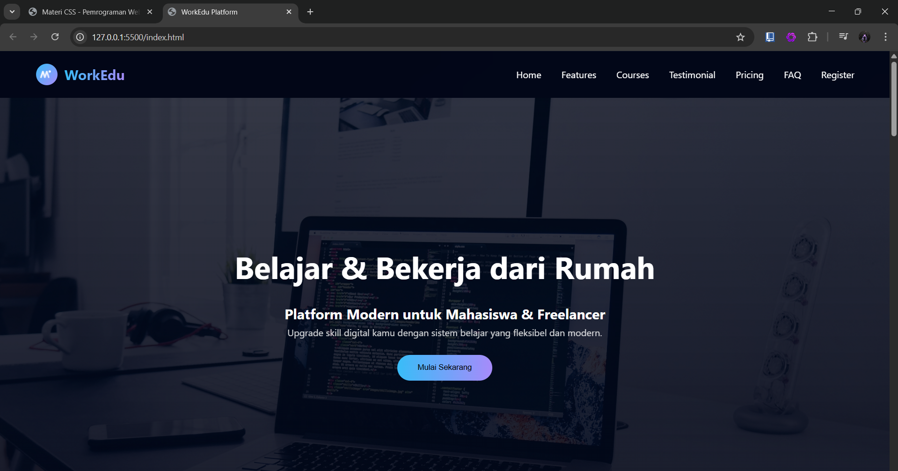
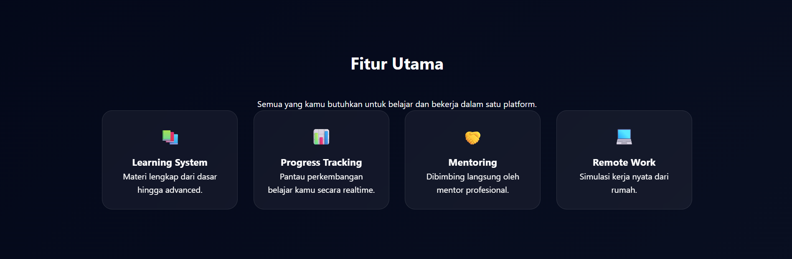
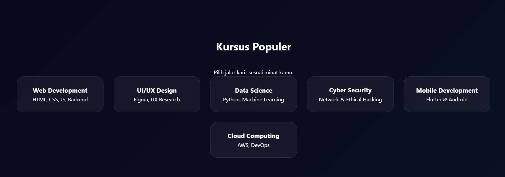
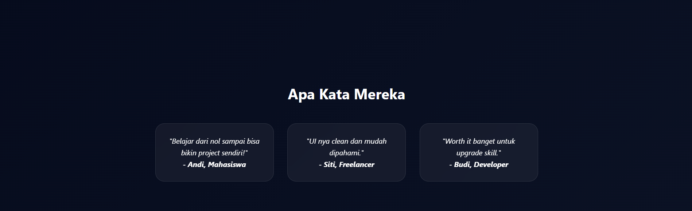
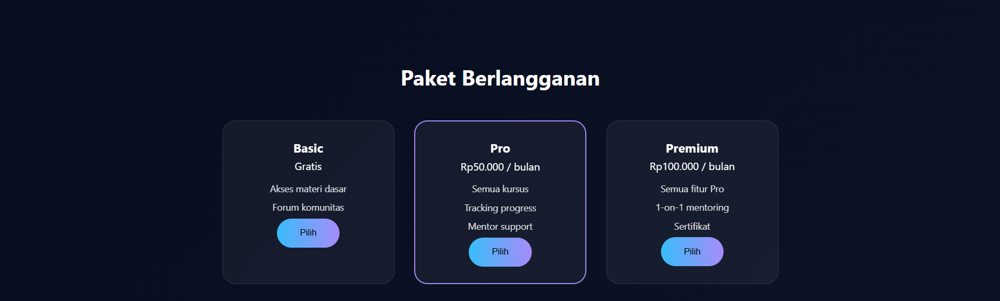
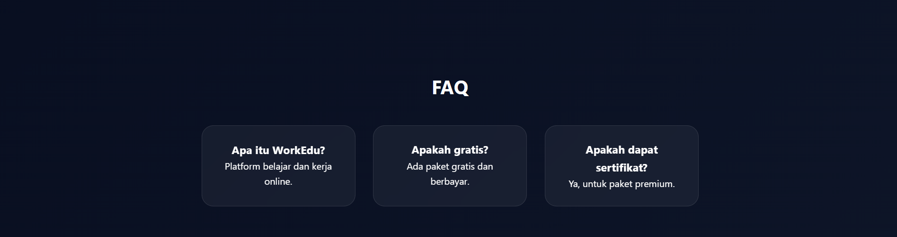
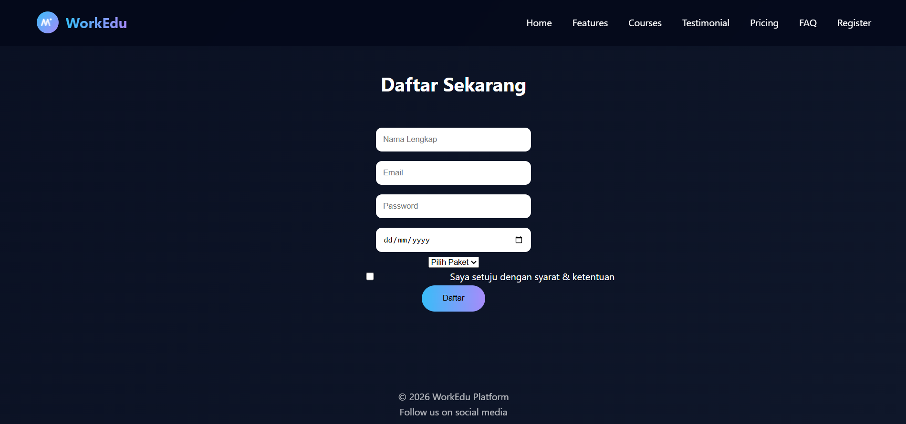

# WorkEdu Platform 🚀

## 📌 Deskripsi

WorkEdu adalah landing page platform belajar dan bekerja dari rumah yang dirancang menggunakan HTML5 dan CSS3. Project ini dibuat untuk memenuhi Tugas 2 Pemrograman Web (Frontend CSS) sekaligus sebagai fondasi untuk pengembangan ke backend di masa depan.

---

## 🎯 Fitur Utama

- ✅ Navbar interaktif dengan hover effect
- ✅ Hero section dengan background image + overlay
- ✅ Section fitur & kursus
- ✅ Testimonial (social proof)
- ✅ Pricing plan (model bisnis)
- ✅ Form registrasi
- ✅ Responsive design (mobile friendly)
- ✅ Animasi hover & transition modern
- ✅ Glassmorphism UI

---

## 📸 Screenshot

### Tampilan Landing Page

---

## 📈 Pengembangan Selanjutnya (Roadmap)

- 🔐 Sistem login & register (backend)
- 📊 Dashboard user
- 💳 Integrasi payment (subscription)
- 🗂️ Database kursus

---

## 👤 Identitas

Nama : Muhammad Akbar  
NIM : F1D02410075  
Kelas : Pemrograman Web C 2026

---

## ⭐ Catatan

Project ini dirancang tidak hanya untuk tugas, tetapi sebagai dasar pengembangan aplikasi web fullstack di masa depan.
